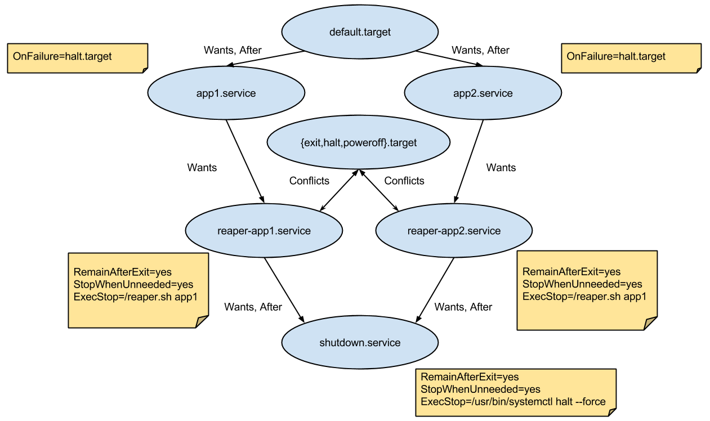

# rkt architecture

## Overview

rkt consists only of a command-line tool, `rkt`, and does not have a daemon.
This architecture allows rkt to be updated in-place without affecting application containers which are currently running.
It also means that levels of privilege can be separated out between different operations.

All state in rkt is communicated via the filesystem.
Facilities like file-locking are used to ensure co-operation and mutual exclusion between concurrent invocations of the `rkt` command.

## Stages

Execution with rkt is divided into several distinct stages.

_**NB** The goal is for the ABI between stages to be relatively fixed, but while rkt is still under heavy development this is still evolving.
Until https://github.com/coreos/rkt/issues/572 is resolved, this should be considered in flux and the description below may not be authoritative._

### Stage 0

The first stage is the actual `rkt` binary itself.
When running a pod, this binary is responsible for performing a number of initial preparatory tasks:

- Fetching the specified ACIs, including the stage 1 ACI of --stage1-image if specified.
- Generating a Pod UUID
- Generating a Pod Manifest
- Creating a filesystem for the pod
- Setting up stage 1 and stage 2 directories in the filesystem
- Unpacking the stage 1 ACI into the pod filesystem
- Unpacking the ACIs and copying each app into the stage2 directories

Given a run command such as:

```
# rkt run app1.aci app2.aci
```

a pod manifest compliant with the ACE spec will be generated, and the filesystem created by stage0 should be:

```
/pod
/stage1
/stage1/manifest
/stage1/rootfs/init
/stage1/rootfs/opt
/stage1/rootfs/opt/stage2/${app1-name}
/stage1/rootfs/opt/stage2/${app2-name}
```

where:

- `pod` is the pod manifest file
- `stage1` is a copy of the stage1 ACI that is safe for read/write
- `stage1/manifest` is the manifest of the stage1 ACI
- `stage1/rootfs` is the rootfs of the stage1 ACI
- `stage1/rootfs/init` is the actual stage1 binary to be executed (this path may vary according to the `coreos.com/rkt/stage1/run` Annotation of the stage1 ACI)
- `stage1/rootfs/opt/stage2` are copies of the unpacked ACIs

At this point the stage0 execs `/stage1/rootfs/init` with the current working directory set to the root of the new filesystem.

### Stage 1

The next stage is a binary that the user trusts to set up cgroups, execute processes, and perform other operations as root on the host.
This stage has the responsibility of taking the pod filesystem that was created by stage 0 and creating the necessary cgroups, namespaces and mounts to launch the pod.
Specifically, it must:

- Read the Image and Pod Manifests. The Image Manifest defines the default `exec` specifications of each application; the Pod Manifest defines the ordering of the units, as well as any overrides.
- Generate systemd unit files from those Manifests
- Create and enter network namespace if rkt is not started with `--net=host`
- Start systemd-nspawn (which takes care of the following steps)
    - Set up any external volumes
    - Launch systemd as PID 1 in the pod within the appropriate cgroups and namespaces
    - Have systemd inside the pod launch the app(s).

This process is slightly different for the qemu-kvm stage1 but a similar workflow starting at `exec()`'ing kvm instead of an nspawn.

### Stage 1 systemd Architecture

rkt's Stage 1 includes a very minimal systemd that takes care of launching the apps in each pod, apply per-app resource isolators and make sure the apps finish in an orderly manner.

We will now detail how the starting, shutdown, and exist status collection of the apps in a pod are implemented internally.



There's a systemd rkt apps target (`default.target`) which has a [*Wants*](http://www.freedesktop.org/software/systemd/man/systemd.unit.html#Wants=) and [*After*](http://www.freedesktop.org/software/systemd/man/systemd.unit.html#Before=) dependency on each app's service file, making sure they all start.

Each app's service has a *Wants* dependency on an associated reaper service that deals with writing the app's status exit.
Each reaper service has a *Wants* and *After* dependency with a shutdown service that simply shuts down the pod.

The reaper services and the shutdown service all start at the beginning but do nothing and remain after exit (with the [*RemainAfterExit*](http://www.freedesktop.org/software/systemd/man/systemd.service.html#RemainAfterExit=) flag).
By using the [*StopWhenUnneeded*](http://www.freedesktop.org/software/systemd/man/systemd.unit.html#StopWhenUnneeded=) flag, whenever they stop being referenced, they'll do the actual work via the *ExecStop* command.

This means that when an app service is stopped, its associated reaper will run and will write its exit status to `/rkt/status/${app}` and the other apps will continue running.
When all apps' services stop, their associated reaper services will also stop and will cease referencing the shutdown service causing the pod to exit.
Every app service has an [*OnFailure*](http://www.freedesktop.org/software/systemd/man/systemd.unit.html#OnFailure=) flag that starts the `halt.target`.
This means that if any app in the pod exits with a failed status, the systemd shutdown process will start, the other apps' services will automatically stop and the pod will exit.

A [*Conflicts*](http://www.freedesktop.org/software/systemd/man/systemd.unit.html#Conflicts=) dependency was also added between each reaper service and the halt and poweroff targets (they are triggered when the pod is stopped from the outside when rkt receives `SIGINT`).
This will activate all the reaper services when one of the targets is activated, causing the exit statuses to be saved and the pod to finish like it was described in the previous paragraph.

### Stage 2

The final stage, stage2, is the actual environment in which the applications run, as launched by stage1.
